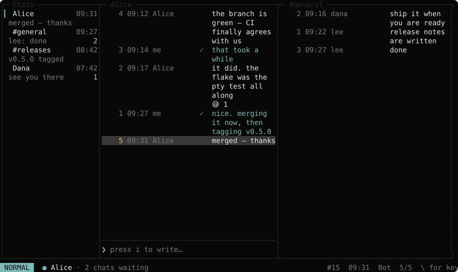

# tglow

**Telegram, with your hands where you left them.**

A Telegram client for the terminal that is vim the whole way down — `j` and `k`
move, `dd` deletes, `3dj` takes three, `.` repeats it, `"+yy` reaches the system
clipboard, `<C-w>\` splits the screen. Not vim-*like*: the same operators over
the same motions, with counts and registers that compose the way you already
expect them to.

One self-contained binary. No runtime, no `node_modules`, no Electron, no
window.

[](https://buymeacoffee.com/tanphat199)
[](https://github.com/phatnt199/tglow)
[](https://phatnt.com)



<sub>Rendered by <a href="scripts/screenshot.tsx"><code>scripts/screenshot.tsx</code></a> through the real components, the real theme and the real layout code — the colours are read back per span rather than drawn by hand. The conversations in it are invented, because the alternative is a photograph of somebody's private Telegram.</sub>

## What it does

- **vim, properly.** Operators compose with motions (`d3j`, `yk`), counts
  multiply the way vim's do — `2d3j` spans six — `.` repeats the last change
  and rescales it, and registers include `"+` for the system clipboard over
  OSC 52.
- **Several chats at once.** Conversations tile as columns you can stack into
  rows. Unfocused panes stay live — they keep receiving and hold their own
  scroll position — but only the focused one has a composer, so `Enter` is
  never ambiguous.
- **Real pictures.** Photos and stickers are sent to the terminal as pixels
  through the [Kitty graphics protocol](https://sw.kovidgoyal.net/kitty/graphics-protocol/)
  or Sixel, not drawn out of characters. Where neither exists, chafa draws them
  and `O` opens the original in your desktop viewer.
- **Everything a chat client owes you.** Replies, edits, deletes, pins,
  forwards, reactions, emoji, file sending, search, folders, online and
  last-seen, typing indicators, unread counts that follow your other devices.
- **Tells you when there is a newer one.** One request a day, `:update` to
  install it — checksum-verified, and `update_check = false` if you would
  rather it never asked.
- **Twelve themes**, and yours if none of them fit.
- **Yours alone.** Your credentials, your session, your cache — all on your
  disk, at `0600`, never leaving it. See [Security](#security).

## Contents

[Install](#install) · [The interface](#the-interface) · [Themes](#themes) ·
[Run from source](#run-from-source) · [Build the binary](#build-the-binary) ·
[The status line](#the-status-line) ·
[Media, reactions and emoji](#media-reactions-and-emoji) ·
[History](#history) · [Commands](#commands) · [Keys](#keys) ·
[Security](#security) · [Development](#development)

## Install

tglow ships as one self-contained binary. There is nothing else to install — no
runtime, no `node_modules`, no repository.

| Platform | File |
| --- | --- |
| Linux x64 | `tglow-linux-x64` |
| macOS Apple silicon | `tglow-macos-arm64` |
| macOS Intel | `tglow-macos-x64` |
| Windows x64 | `tglow-windows-x64.exe` |

All four are built from one machine by `scripts/build-all.sh`, and all four are
verified as far as their file format and the renderer inside them. Only the
Linux one is *run* before release — if a macOS or Windows build misbehaves,
[say so](https://github.com/phatnt199/tglow/issues), because you found it
before we did.

1. Download the file for your platform and `tglow.sha256`, check it, and make
   it executable.

   ```sh
   sha256sum -c tglow.sha256
   chmod +x tglow-linux-x64
   mv tglow-linux-x64 ~/.local/bin/tglow      # or anywhere on your PATH
   ```

   On macOS, Gatekeeper will refuse an unsigned binary downloaded from the
   internet the first time: `xattr -d com.apple.quarantine tglow-macos-arm64`.

2. **Get your own `api_id` and `api_hash`** from <https://my.telegram.org> (log
   in, then "API development tools"). tglow ships no keys and never will: these
   identify *your* application to Telegram, they are issued against your own
   account, and nobody can obtain them for you. It takes about a minute.

3. Write them to `~/.config/tglow/config.toml` — or, on Windows,
   `%APPDATA%\tglow\config.toml`:

   ```toml
   api_id = 1234567
   api_hash = "your-hash-here"
   palette = "sage"
   ```

4. Run it:

   ```sh
   tglow
   ```

   The first run asks for your phone number, then the code Telegram sends you,
   then your two-factor password if you have one. The code and the password are
   not echoed. tglow then goes straight into the interface — there is no second
   launch — and later runs skip all of this.

Everything tglow stores lives under `~/.local/share/tglow/` — on Windows,
`%LOCALAPPDATA%\tglow\`: the session, the message cache, the thumbnails and the
log. Deleting that directory makes this machine forget your account, but leaves
the session authorised on Telegram's side — use `:logout` to end it properly.

macOS gets the same `~/.config` and `~/.local/share` as Linux rather than
`~/Library/Application Support`. That directory is right for an application
with a window; tglow is configured by hand-editing a file, which is a thing
every neighbour it has on a Mac keeps in `~/.config`.

## The interface

One frame, divided. The sidebar stacks your Telegram **folders** over the
**chat list** and keeps the left edge; everything right of it belongs to the
conversations, which start as one and split into as many as four — see
[Several chats at once](#several-chats-at-once). The focused pane's border is
drawn in the palette's accent, so which pane has focus is visible without
hunting for the cursor.

Folders are your own, read from Telegram. `]f` and `[f` move between them.
tglow evaluates the folders you build by picking chats exactly; a folder built
purely on "all contacts", "unmuted only" or "not archived" will show fewer
chats here than in the official client, because tglow does not cache contact,
notification or archive state. The rail is hidden entirely if you have no
folders.

Each chat shows two rows — name and time, then the last thing said and how much
is unread. When someone is **typing**, recording a voice message or choosing a
sticker, that displaces the preview and appears in the open chat's title.

In a wide window your own messages sit on the right and the other side's on the
left, the way a graphical client lays them out. Below sixty columns of
conversation everything stays left-aligned: right-aligning in a cramped pane
costs the text the room it has least of.

### Resizing

Drag the divider between the sidebar and the conversation to move it. Drag the
divider between the folders and the chat list to move that one — up to the top
puts the folder rail away, and dragging back down brings it back. Neither is
persisted between runs; see `sidebarWidth` in the source for why.

### The mouse

tglow holds the mouse by default. This is not new — OpenTUI has enabled mouse
reporting since the first release — but tglow now intends to use it. Hold
`Shift` for your terminal's own click-and-drag selection, which is the usual
convention and is the terminal's behaviour rather than anything tglow does.

To hand the mouse back completely:

```toml
mouse = false
```

## Themes

tglow ships the twelve [devglow](https://github.com/phatnt199/devglow) palettes:
`sage` (the default), `ember`, `amber`, `ash`, `blush`, `dusk`, `mocha`, `moss`,
`nocturne`, `plum`, `tide` and `vesper`. Choose one in `config.toml`:

```toml
palette = "nocturne"
```

### Writing your own

Drop a `.toml` into `themes/` beside your config file and name it in
`palette`. A file
there **shadows a built-in of the same name**, so `themes/sage.toml` overrides
the shipped sage — the same way a colorscheme in `~/.config/nvim/colors` wins
over one from a plugin. That is how you adjust a palette without rebuilding.

All seventeen keys are required, each a six-digit `#RRGGBB`. A file that is
missing a key, carries a value that is not a colour, or cannot be parsed is
**not applied**: tglow draws sage instead and says why on the status line.
It never refuses to start over a theme file — a typo in one is a typo, not a
reason to lose access to your messages. Press `<C-l>` to dismiss the notice.

`~/.config/tglow/themes/midnight.toml`, with sage's own values as a worked
example:

```toml
FOREGROUND = "#E6E6E6"   # body text
BACKGROUND = "#080808"   # the window itself
RED        = "#AF5F5F"   # errors, and the mode block while confirming
GREEN      = "#87AFAF"   # inline code, and the online dot
BLUE       = "#7590AF"
ORANGE     = "#D59572"
YELLOW     = "#E5B567"
PINK       = "#D68C8C"   # VISUAL mode
GOLD       = "#EBC17A"   # INSERT mode, unread counts
TEAL       = "#7DB9B6"   # NORMAL mode, your own messages, the active chat
SKY        = "#7EAAC7"   # links
WINE       = "#924653"
DARK_00    = "#111111"
DARK_01    = "#181818"
DARK_02    = "#282828"   # rules and borders
DARK_03    = "#383838"   # the cursor line
DARK_04    = "#797979"   # timestamps, gutter, anything dimmed
```

The comments name where each role is actually drawn. The six without one —
`BLUE`, `ORANGE`, `YELLOW`, `WINE`, `DARK_00` and `DARK_01` — are still
required, so a theme stays a complete devglow palette and keeps working when a
later version starts using them, but nothing renders in them today.

## Run from source

```sh
bun install
bun start
```

You still need `~/.config/tglow/config.toml` as above. To re-authenticate
without starting the interface:

```sh
bun run scripts/login.ts
```

## Build the binary

```sh
bun run build
```

Writes `dist/tglow` and `dist/tglow.sha256`. The build regenerates
`src/core/cache/migrations.generated.ts` from `drizzle/` first: a compiled
binary has no `drizzle/` folder to read migrations from, so they are compiled
in, and a test fails if the committed copy ever drifts from `drizzle/`.

## The status line

One row, lualine's shape, and as much of this as the terminal has columns for:

```
 NORMAL  ● Work  Alice · group · 3 unread · typing…     "a3d  ⚑  #1482  14:32  4%  12/240  \ for keys
```

| Field | Says |
| --- | --- |
| `NORMAL` | the mode, and red while a delete is waiting on `y`/`n` |
| `◐` `✕` | connecting, offline — a healthy connection is not drawn at all |
| `●` | the other side is online, in green, immediately before their name |
| `Work` | the active folder, when you have narrowed to one |
| `Alice · group` | the open chat and what kind it is — a plain DM gets no tag |
| `3 unread · typing…` | what is waiting in it, and what the other side is doing |
| `"a3d` | vim's showcmd: the register, count and operator you have typed so far |
| `137/4096` | characters in the composer against Telegram's limit, while in insert mode — red past it |
| `⚑ #1482 14:32` | the message under the cursor: pinned, its id, its clock |
| `4% 12/240` | how far down the history you are |

Nothing is clipped to fit. Each field has a priority, and a narrow terminal
drops the cheapest ones whole — `\ for keys` first, the position and the mode
last. A data-integrity warning claims whatever width it needs.

## Media, reactions and emoji

A message that carries something other than text says what it is, on its own
line above any caption:

```
📷 Photo · 1280×960        🎤 Voice · 0:12         📎 report.pdf · 2.4 MB
🎬 Video · 1:05            🐱 Sticker              📍 Location
🎵 Diễm Xưa · 4:05         🎞 GIF · 0:03           📊 Poll · Ăn gì trưa nay?
```

**Photos are drawn.** tglow renders them with
[chafa](https://hpjansson.org/chafa/), which picks the character that best fits
each cell out of half blocks, quadrants, sextants and braille — so a picture
comes out as a picture rather than as coloured blocks. The descriptor stays
above it: it says what the thing is and how big, which a squint at forty cells
does not.

Thumbnails are fetched once and kept under `~/.local/share/tglow/thumbnails/`.
A sticker still shows the emoji it stands for — the animated ones carry a video
where a thumbnail should be, and tglow does not draw video.

This works in any terminal, because it is text. Nothing is required beyond the
binary — the chafa WebAssembly is compiled into it.

### Seeing the real picture

A drawing made of characters is a drawing, not the photograph. For the actual
pixels, press `O` (or `:view`): tglow downloads the picture at full size and
hands it to whatever your desktop opens pictures with.

That indirection is not a shortcut — it is the only route on some terminals.
**Alacritty cannot display images at all**: no Sixel, no Kitty graphics
protocol, no iTerm2 inline images. It is a deliberate, long-standing decision
of that project, and no library can work around a terminal that has no
mechanism to receive image data.

In a terminal that *can* take a picture, tglow sends the photograph itself and the terminal composites it over those
same cells, so what you see is the photograph. The drawing stays underneath:
it is what a terminal that ignores the sequences shows, and it is what decides
how many rows the message takes either way. It works this
out from the environment rather than by querying the terminal, because a
query's reply arrives on stdin and would be read as keystrokes nobody typed.
| Protocol | Terminals | tglow |
| --- | --- | --- |
| Kitty graphics | kitty, Ghostty, WezTerm, Konsole | preferred — a picture that scrolls is *moved*, not resent |
| Sixel | GNOME Terminal, GNOME Console, foot, xterm, Contour, mlterm | used when Kitty's is not offered |
| neither | **Alacritty** | the chafa drawing, and `O` for the real thing |

Escape hatches:

```sh
TGLOW_GRAPHICS=off    tglow   # keep the drawing everywhere
TGLOW_GRAPHICS=on     tglow   # force Kitty graphics on a terminal tglow does not know
TGLOW_CELL_SIZE=8x16  tglow   # Sixel measures in pixels; say what a cell is if 10x20 is wrong
```

Reactions are tallied under the message: `👍 3  ❤️ 1  [😂] 2`. The brackets mark
your own, in brackets rather than colour so it survives a terminal without
colour and survives being copied out of one.

A green dot before a name — in the chat list and before the open chat's own
title — means that person is online. The status line says when they were last
seen instead, for anyone who is not. Telegram is deliberately vague for
anyone who hides their exact time — "recently", "within a week" — and tglow
does not sharpen it into a time it does not have.

Emoji are typed like any other character. Anything built from more than one
code point — a skin tone, a flag, a family, `❤️` — used to be dropped silently
on the way to the composer, as was decomposed Vietnamese from an input method
that emits it. Both work.

## History

Opening a chat loads the newest 50 messages and puts the cursor on the last
one. Scrolling back toward the top loads the 50 before it, and so on — the page
is fetched a few rows before you reach the end of the loaded ones, so it is
usually already there by the time you get there. `loading…` appears on the
status line while one is in flight.

The cache is asked before the network, so pages you have read before come back
with no round trip and are readable with no connection at all. A page shorter
than 50 means the start of the conversation; nothing is requested after that.

`/` searches the whole cached chat, not only the part on screen — if the match
is older than what is loaded, the pages between are fetched before it jumps.

## Commands

`:` opens the command line. `<Tab>` completes, `<Esc>` cancels, and
backspacing past the `:` closes it. The hint on the right shows what a
half-typed word could still become.

| Command | Action |
| --- | --- |
| `:q` `:quit` `:q!` `:qa` | close tglow — the same as `<C-c>` |
| `:{number}` | jump to that message, counting from 1 |
| `:h` `:help` | show the key bindings |
| `:read` | mark the open chat read |
| `:pin` / `:unpin` | pin or unpin the message under the cursor |
| `:e` `:reload` | reload the open chat from Telegram |
| `:view` `:open` | open the picture under the cursor at full size, in an image viewer |
| `:send <path>` `:upload` | send a file — the composer becomes its caption, and `~` works |
| `:update` | check for a newer tglow, and install it when one is known |
| `:logout` | sign out on Telegram, erase the local session and cache, and quit — asks `y`/`n` first |

Everything here is also a key, or is something no key should be: `:q` is
`<C-c>`, `:pin` is `P`, and `:logout` has no binding at all, because a single
keystroke should not be able to end a session.

### Logging out

`:logout` calls Telegram's own `auth.logOut`, so tglow stops being listed under
Active Sessions on your other devices, then deletes `~/.local/share/tglow/session`
and `~/.local/share/tglow/cache.sqlite`. The next launch starts at the phone
number prompt.

Deleting those two files by hand does most of the same thing, but *not* the
first part: the session stays authorised on Telegram's side until you revoke
it from another device.

## Keys

Leader is `\`. The application starts in NORMAL mode — nothing you type is sent
by accident.

### Overlays

| Key | Action |
| --- | --- |
| `\` | show key bindings |
| `<C-p>` | fuzzy jump to any chat (type to filter, `<C-n>`/`<C-p>` or `j`/`k` to move, `Enter` to open, `Esc` to cancel) |
| `/` | search the open chat's cached messages (type to filter, `Enter` jumps to the first match, `Esc` cancels and restores the cursor) |
| `n` / `N` | jump to the next / previous search match |

### Movement

| Key | Action |
| --- | --- |
| `j` / `k` | next / previous message |
| `3j` | down three messages |
| `gg` / `G` | oldest loaded / newest |
| `<C-d>` / `<C-u>` | half page down / up |
| `gf` | focus the chat list |
| `]f` / `[f` | next / previous chat folder |
| `]u` / `[u` | next / previous chat with unread messages, and open it |
| `Enter` (chat list) | open the chat |
| `Esc` (chat list) | back to messages, without opening anything |

### Several chats at once

Conversations arrange themselves as columns, each of which can be stacked
into rows. Four at most, and a split is refused with a reason rather than
drawn when there is no room for it — forty columns and eight rows each.

Splitting leaves the focus in the chat list, because the reason to want a
second pane is a second chat: `<C-w>\`, then pick one, then `Enter`.
`Esc` comes back to the new pane instead, still showing what it was split
from.

| Key | Action |
| --- | --- |
| `<C-w>\` | split into a column (`<C-w>v` too) |
| `<C-w>-` | split the column into another row (`<C-w>s` too) |
| `<C-w>h` `j` `k` `l` | move the focus — left and right change column, up and down move within one |
| `<A-S-h>` `j` `k` `l` | the same four moves, without the prefix |
| `<C-w>w` | the next conversation, wrapping |
| `<C-w>c` | close this one (the last one stays) |

`<C-w>h` from the leftmost column still lands in the chat list, which is
what it always did.

Only the focused pane has a composer. The others are live views — they
keep receiving messages and hold their own scroll position, so two views
of one chat can sit at different places in it, but there is never a
question about which conversation `Enter` sends to.

### Messages

| Key | Action |
| --- | --- |
| `zs` | reveal a spoiler under the cursor |
| `zn` | show or hide the line-number gutter |
| `zt` | show or hide timestamps |
| `K` | show the URL of a link under the cursor |
| `r` | reply to the message under the cursor, straight into the composer |
| `e` | edit your own message under the cursor |
| `P` | pin or unpin — the message under the cursor, or the chat when the chat list has focus |
| `R` | react to the message: `R` then the key beside the emoji |
| `F` | forward the message to a chat, chosen from the same picker `<C-p>` uses |
| `O` | open the message's picture at full size, in an image viewer |
| `d{motion}` / `dd` / `3dd` | delete the message under the cursor, or a range (asks `y`/`n` first, and says how many) |
| `y{motion}` / `yy` | yank the message(s) under the cursor into a register |
| `c{motion}` / `cc` | edit (change) the message under the cursor, same as `e` |
| `"a` / `"+` then `y`/`d` | name a register first — any letter, or `+` for the system clipboard |
| `.` | repeat the last change |

### Insert mode

| Key | Action |
| --- | --- |
| `i` / `a` | write a message |
| `<A-Enter>` (insert) | a new line, rather than sending |
| `jk` or `Esc` | leave insert mode |
| `Enter` (insert) | send |

### Application

| Key | Action |
| --- | --- |
| `<C-l>` (normal) | dismiss a data-integrity warning on the status line |
| `:` | open the command line — see Commands above |
| `<C-c>` (normal) | quit |

## Security

`~/.local/share/tglow/session` is equivalent to a logged-in device on your
account. It is written mode `0600` and git-ignored. Never share it.

The login prompts read the code and the two-factor password in raw mode so
neither is echoed or left in your scrollback, and none of the phone number, the
code, the password or the session string is ever written to the log.

Third-party MTProto clients can attract account restrictions if they behave
abnormally. tglow does not poll, and reports a truthful device model.

A `FLOOD_WAIT` — Telegram rate-limiting your account — is handled rather than
passed through. It used to reach the status line as `Send failed: FLOOD_WAIT_30`,
which invites pressing Enter again, and retrying inside the window is exactly
what extends it. tglow now says *"Rate limited by Telegram — wait 30s before
trying again"*, and refuses the next send to that chat locally until the window
has passed, so the retry that would make it worse never leaves the machine.

### The one request that is not to Telegram

Once a day, at startup, tglow asks the GitHub releases API whether a newer
version exists, and says so in the status line if there is. That is the only
request it makes to anything other than Telegram, it sends nothing but a user
agent naming the version, and it can be turned off:

```toml
update_check = false
```

The check never downloads anything. Installing happens only when you type
`:update`, and then:

- the published `tglow.sha256` is fetched **first**, so there is something to
  check against before there is anything to check;
- the binary is downloaded beside the running one, so the final rename is on
  one filesystem and therefore atomic;
- its SHA-256 must match the line naming it, or the download is deleted and
  nothing is installed — a self-updater writes what will later be run as you,
  so the one thing it must never do is install bytes it cannot account for;
- the download URL is composed from a hard-coded `github.com` and checked
  against it, rather than followed from the API response.

On Linux and macOS the running binary is replaced in place — the process keeps
the inode it already opened, so the tglow you are using is unaffected until you
restart it. Windows will not touch a locked image, so the old one is moved to
`tglow.exe.old` and removed on the next launch.

If you would rather never have tglow write to its own binary, set
`update_check = false` and install releases the way you installed the first
one. Nothing else in tglow depends on this.

## Development

```sh
bun test          # no network or account needed
bun run typecheck
```

Conventions: `docs/superpowers/conventions/ignis-style.md`.
Design: `docs/superpowers/specs/`. Plans: `docs/superpowers/plans/`.
Logs go to `~/.local/share/tglow/tglow.log` — never stdout, which would corrupt
the alternate screen.
